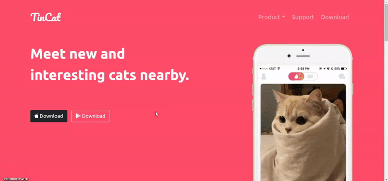

<!-- Add banner here -->

# TinCat

<!-- Describe your project in brief -->
A single landing page that shows 'TinCat', an application for cats who looking for hot kitties by wrapping all pages with the Bootstrap CSS framework.

# Table of contents

- [TinCat](#tincat)
- [Table of contents](#table-of-contents)
- [Demo Preview](#demo-preview)
- [Features](#features)
- [Languages](#languages)
- [Technology](#technology)
- 
# Demo Preview
[(Back to top)](#table-of-contents)

[TinCat Landing Page](https://thasup.github.io/TinCat/)

# Features
[(Back to top)](#table-of-contents)

- Resonsive design that completely support all devices
- Rich detail of bootstrap features and abilities
- Great quality layout design
- Super funny meme

# Languages
[(Back to top)](#table-of-contents)

- HTML
- CSS

# Technology
[(Back to top)](#table-of-contents)

- html
- css
- bootstrap
